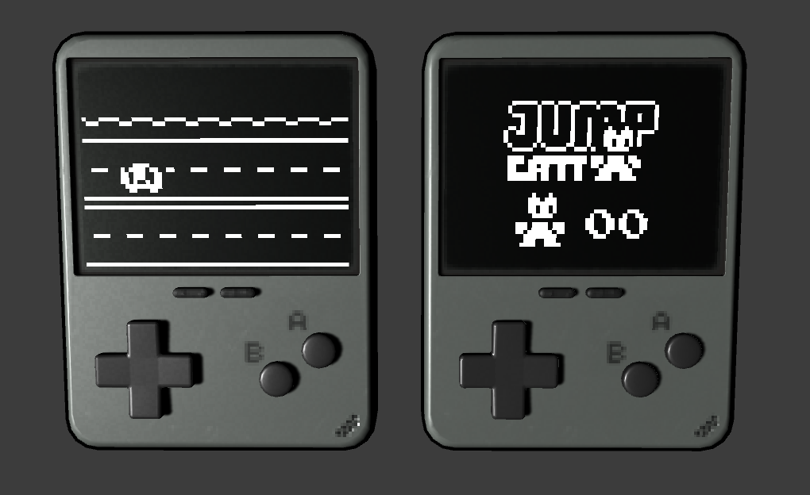

# Unity Mini-Game Library

UMGL is a library for rendering 2D sprites onto a 3D plane

## What is it for?

The primary use of this project is creating virtual screens in a 3D game — In particular: creating virtual game devices with a single-script game running on it’s virtual screen.

All of this, without the hassle of setting up a second camera and having to hide a whole 2D game somewhere in the 3D environment.



## How to install into your project

- Simply download and install the umgl package and install it into your project
- Copy the screen prefab into your scene, unpack it, and attach it to your desired virtual device

## Creating mini-game scripts

Starting a new mini game for a screen is straight forward:

- Create a new script that inherits from `MiniGame` instead of `MonoBehaviour`
- Add the required functions: `NewGame()`, `Title()`, and `Draw()`

```csharp
class NewMiniGame : MiniGame
{

    public override void Title()
    {
        // title screen loop
    }

    public override void NewGame()
    {
        // runs once when transitioning from Title to Draw
    }

    public override void Draw()
    {
        // game loop
    }

}
```

## MiniGame

MiniGame is an abstract class that handles button inputs and game states.

### Game states

MiniGame has three states that it cycles through automatically:
**Title**, **Game**, and **Paused**

- The screen starts in the **Title** state which calls `Title()` each frame
- If `START`, `A`, or `B` is pressed in the **Title** state, `NewGame()` will be called once and it will switch to the **Game** state where it calls `Draw()` each frame
- If the function `GameOver()` is called, it switches back to **Title**
- And lastly it switches to **Paused** if `START` is pressed in the **Game** state, or if `Pause()` is called


### Other utilities

- `frameCount` is a count of the frames since awake — useful for timers and animations
- `Pause()` as mentioned above, pauses the game — it can be called from other scripts
- `GameOver()` as mentioned above, ends the game and brings it back to the title screen

## MiniRenderer

The MiniRenderer attached to your screen is in charge of rendering sprites and text at the set frame rate.


Access the renderer in a MiniGame script with the variable `R` eg.
```csharp
R.spr(0, 0, 16, 16);
```

### Sprites

```csharp
void spr(
	int sx,
	int sy,
	float dx,
	float dy,
	int sw,
	int sh,
	bool flip,
	float dw,
	float dh
)
```

`sx`, `sy` are the x, y coordinates on the sprite sheet of the sprite you want to draw to the screen

`dx`, `dy` are the x, y coordinates that the sprite is drawn to the screen

Optional parameters:

`sw`, `sh` is the width and height of the sprite on the sprite sheet
(default: 16, 16)

`flip` determines if the sprite is drawn flipped or not
(default: false)

`dw`, `dh` is the width and height you want to draw the sprite at on the screen
(defaulted to match `sw`, `sh`)

### Text

```csharp
void put(String str, float x, float y)
```

str is the int or String you want to write on the screen

`x`, `y` are the coordinates you want to draw the text on the screen at
(defines the bottom left corner rather than the top left)

### Layers

```csharp
void lset(int layer)
```

`layer` is which layer you want to start drawing on

## Button Input

Currently, buttons are limited to a similar setup to a GameBoy:
 `A`, `B`, `LEFT`, `RIGHT`, `UP`, `DOWN`, `START`, `SELECT`

To create a new button mapping you can edit the default button map, or create a new ButtonMap scriptable object

### Button Booleans

To check if a button is pressed on any given frame use:

```csharp
btn.<button> // returns true or false for given button
```

(eg. `btn.a`, `btn.b`, `btn.up` etc.)

To check if a button was pressed on the previous frame use:

```csharp
`pbtn.<button>` // returns true or false for given button
```

(eg. `pbtn.a`, `pbtn.b`, `pbtn.up` etc.)

This setup allows for a variety of use cases such as:

```csharp
(btn.a && !pbtn.a)
// returns true only on the exact frame we hit the button
```

or:

```csharp
(!btn.a && pbtn.a)
// returns true only on the exact frame we released a button
```

If you want to check if a couple buttons have just been pressed we can use:

```csharp
(btn.a && !pbtn.a) || (btn.b && !pbtn.b)
// true on the frame a or b have been pressed
```